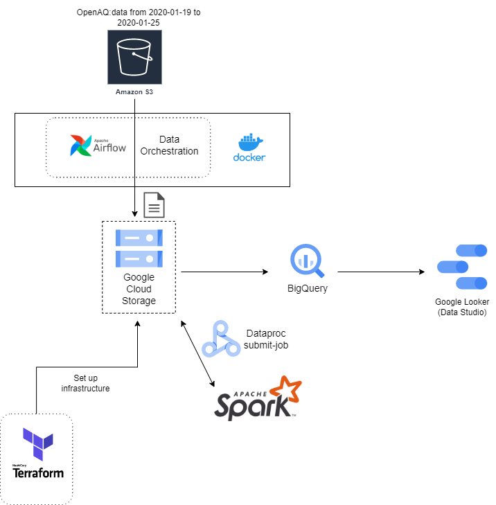

# OpenAQ World Air Quality

## Overview

This project focuses on practicing building an end-to-end data pipeline using data source from AWS S3 bucket [OpenAQ](https://registry.opendata.aws/openaq/). The data we are interested in is the daily realtime record of measurement for different parameters in measuring the quality of the air within each country and cities. Due to the limitation of features and offer Google Cloud Platform free trial can provide, we will retrieve only certain intervals of days.

In this project we will focus only the parameter ["PM"](https://www.epa.gov/pm-pollution/particulate-matter-pm-basics), which includes PM 2.5 (pm25) and PM 10 (pm10). According to Google trends, the term "PM 2.5" has been searched the most frequently in the period of 2020-01-19 to 2020-01-25. So we will retrieve data only from this interval.

For more information about OpenAQ data format click [here](https://github.com/openaq/openaq-data-format)

## Technologies

technologies used in this project are as the following:

- Google Cloud Platform (GCP): :memo: **Free Trial Credits**
  - Data Lake: Google Cloud Storage (GCS)
  - Data Warehouse: BigQuery
- AWS S3 Bucket:
  - AWS IAM user credentials
- Infrastructure as code (IaC): Terraform
- Containerization: Docker
- Workflow Orchestration: Airflow
- Data Transformation: Apache Spark
- Data Visualization: Looker (Google Data Studio)

## Tools

Test on local computer in Windows OS:

- Docker Desktop and Docker-Compose
- Python 3.9 (via [Miniconda](https://docs.conda.io/en/latest/miniconda.html))
- Google Cloud SDK 404.0.0
- Terraform v1.3.1

## Architecture

The way this project is setup is as follow:

> 1. [terraform](/terraform/)
> 2. [airflow](/airflow/)
> 3. [spark](/spark/)

