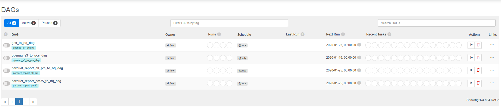
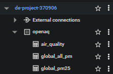

# Setup

## Prerequisites

1. Rename your gcp-service-accounts-credentials file to `google_credentials.json` and store it in your `$HOME` directory

   ```bash
       cd ~ && mkdir -p ~/.google/credentials/
       mv <path/to/your/service-account-authkeys>.json ~/.google/credentials/google_credentials.json
   ```

2. Python version: 3.7+

## Airflow Setup

- Reference: https://airflow.apache.org/docs/apache-airflow/stable/howto/docker-compose/index.html

1. Create a new sub-directory called `airflow` in your `project` dir (such as the one we're currently in)

2. **Set the Airflow user**:

   ```bash
   cd airflow/
   # Created `dags`, `logs` and `plugins` directory and output airflow id to .env
   mkdir -p ./dags ./logs ./plugins
   echo -e "AIRFLOW_UID=$(id -u)" > .env
   ```

## Execution

1. Build the image from `Dockerfile`

   ```shell
   docker-compose build
   ```

2. Initialize the Airflow scheduler, DB, and other config

   ```shell
   docker-compose up airflow-init
   ```

3. Kick up the all the services from the container:

   ```shell
   docker-compose up
   ```

4. In another terminal, run `docker-compose ps` to see which containers are up & running (there should be 9, matching with the services in your docker-compose file).

5. In the same terminal run `docker exec -it aws-cli bash` to enter aws-cli command line. Then run the following commands:

   ```bash
   # check aws-cli version
   aws --version
   ```

   ```bash
   # check if aws credentials we provided as airflow environment variables in docker-compose.yaml file are passed to the aws-cli containers.
   aws configure list
   ```

6. Login to airflow web UI on `localhost:8080` with default credentials: `airflow/airflow`

7. Run DAGs on the Web Console UI.

8. Once finished, you can run the following commands:

   ```shell
   docker-compose down
   ```

   To stop and delete containers, delete volumes with database data, and download images, run:

   ```
   docker-compose down --volumes --rmi all
   ```

   or

   ```
   docker-compose down --volumes --remove-orphans
   ```

## Running airflow dags

1. In the airflow web UI tab, run the dags in the following steps:

2. run `openaq_s3_to_gcs_dag` in order to download all the files needed from the openAQ AWS S3 bucket, and at the same time, they will be uploaded to Google Cloud Storage bucket.

3. run `gcs_to_bq_dag` to create a table named `air_quality` in the BigQuery

4. We will perform data transformation using Apache Spark, so click the link below to follow the instructions from the `README` file within the [**_spark directory_**](../spark/)

5. After we are done with transforming data using Apache Spark, we will run `parquet_report_all_pm_to_bq_dag` and `parquet_report_pm25_to_bq_dag` to create two tables called `global_all_pm` and `global_pm25` in BigQuery. Which we will use these two tables in order for perform data visualization using Looker (Google Data Studio). Some snapshots of the data visualization can be found in the directory [here](../images/looker/snapshots/)



<p>All dags</p>



<p>BigQuery outline</p>

## References

### airflow

- https://airflow.apache.org/docs/apache-airflow/stable/start/docker.html
- https://airflow.apache.org/docs/docker-stack/build.html
- https://airflow.apache.org/docs/docker-stack/recipes.html
- https://airflow.apache.org/docs/apache-airflow/stable/howto/docker-compose/index.html
- https://airflow.apache.org/docs/apache-airflow-providers-amazon/stable/operators/s3.html
- https://airflow.apache.org/docs/apache-airflow-providers-amazon/2.2.0/_api/airflow/providers/amazon/aws/operators/s3_list/index.html#airflow.providers.amazon.aws.operators.s3_list.S3ListOperator
- https://airflow.apache.org/docs/apache-airflow-providers-google/stable/operators/cloud/bigquery.html#
- https://airflow.apache.org/docs/apache-airflow/2.2.3/templates-ref.html
- https://airflow.apache.org/docs/apache-airflow/stable/concepts/xcoms.html

### GCP

- https://cloud.google.com/python/docs/reference/storage/latest
- https://cloud.google.com/storage/docs/uploading-objects#storage-upload-object-code-sample
- https://cloud.google.com/bigquery/docs/batch-loading-data
- https://cloud.google.com/bigquery/docs/reference/rest/v2/tables#externaldataconfiguration

### AWS

- https://hub.docker.com/r/amazon/aws-cli
- https://docs.aws.amazon.com/cli/index.html
- https://boto3.amazonaws.com/v1/documentation/api/latest/guide/s3-example-download-file.html

### Miscellaneous References

- https://crontab.guru/
- https://repost.aws/questions/QUvLGfn63wTSabPpgzjU7seg/mwaa-environment-dags-cannot-find-airflow-providers-amazon-aws-operators
- https://stackoverflow.com/questions/71874194/use-list-output-from-a-pythonoperator-to-iterate-another-operator-in-airflow2
- https://stackoverflow.com/questions/67289076/apache-airflow-s3listoperator-not-listing-files
- https://stackoverflow.com/questions/69424336/airflow-2-push-xcom-with-key-name
