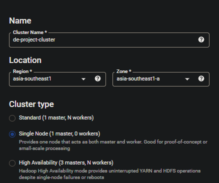

# Overview

Using Pyspark that is written in a python script called [`dataproc_spark.py`](code/dataproc_spark.py) to transform the data from Google Cloud Storage bucket. The script output two `.parquet` files, which contain only necessary information. One file contains only information of parameter `pm25` and the other file contains parameter of `pm25` and `pm10`. Both of these output files will be uploaded to Google Cloud Storage bucket in their specific directory.

After that, we will go back to the [airflow directory](../airflow/) and continue following the instructions there.

## Creating a Cluster

### Via [Dataproc Console UI](https://console.cloud.google.com/dataproc/clusters?authuser=2&project=de-project-370906)



## Submit a job using _Dataproc-submit-job_

- Reference: https://cloud.google.com/dataproc/docs/guides/submit-job#dataproc-submit-job-gcloud
- via gcloud SDK

```bash
# login to your gcloud cli account or else might get an error -> ServiceException: 401 Anonymous caller does not have storage.objects.list access to the Google Cloud Storage bucket. Permission 'storage.objects.list' denied on resource (or it may not exist).
gcloud auth login
```

```bash
# Upload python script to Google Cloud Storage bucket with specified location
gsutil cp dataproc_spark.py gs://openaq_data_lake_de-project-370906/code/dataproc_spark.py
```

```bash
# Submit a job
gcloud dataproc jobs submit pyspark \
    --cluster=de-project-cluster \
    --region=asia-southeast1 \
    gs://openaq_data_lake_de-project-370906/code/dataproc_spark.py \
    -- \
        --output_pm25=gs://openaq_data_lake_de-project-370906/report/parquet/pm25 \
        --output_all_pm=gs://openaq_data_lake_de-project-370906/report/parquet/all_pm
```
